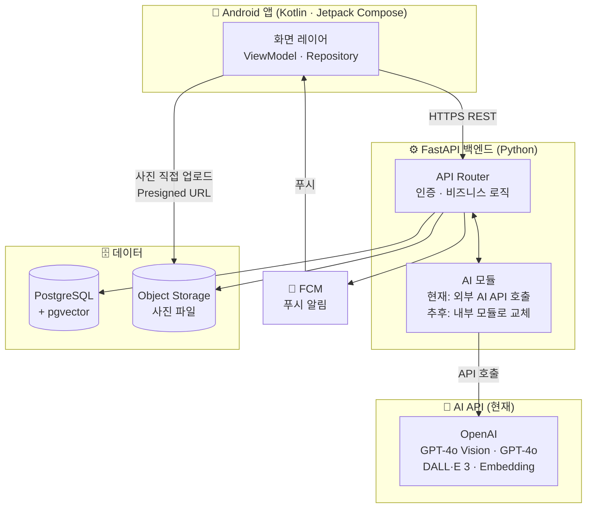
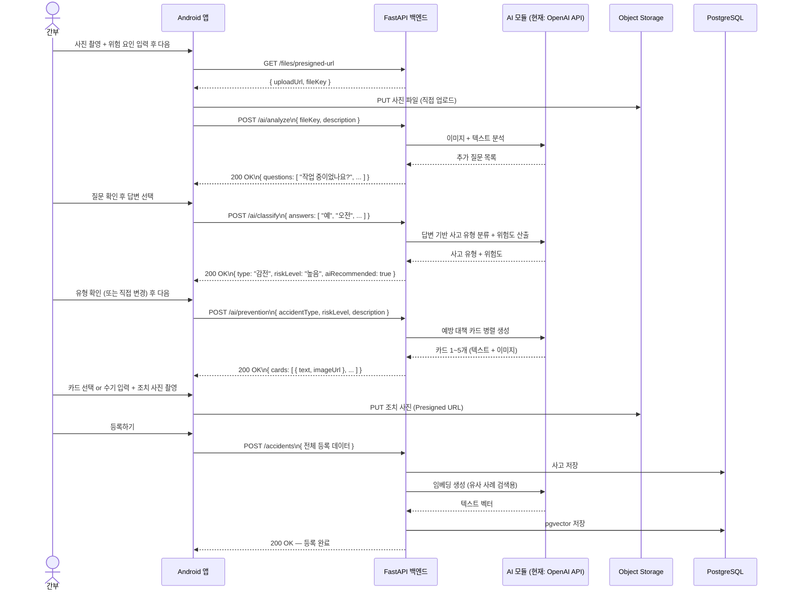

# 소프트웨어 아키텍처

---

## 1. 시스템 구성도

```mermaid
graph TB
    subgraph CLIENT["📱 Android 앱 (Kotlin · Jetpack Compose)"]
        APP["화면 레이어\nViewModel · Repository"]
    end

    subgraph BACKEND["⚙️ FastAPI 백엔드 (Python)"]
        ROUTER["API Router\n인증 · 비즈니스 로직"]
        AI_MOD["AI 모듈\n현재: 외부 AI API 호출\n추후: 내부 모듈로 교체"]
        ROUTER <--> AI_MOD
    end

    subgraph AI_EXT["🤖 AI API (현재)"]
        OPENAI["OpenAI\nGPT-4o Vision · GPT-4o\nDALL·E 3 · Embedding"]
    end

    subgraph DATA["🗄️ 데이터"]
        PG[("PostgreSQL\n+ pgvector")]
        S3[("Object Storage\n사진 파일")]
    end

    FCM["📨 FCM\n푸시 알림"]

    APP -->|"HTTPS REST"| ROUTER
    APP -->|"사진 직접 업로드\nPresigned URL"| S3

    AI_MOD -->|"API 호출"| OPENAI

    ROUTER --> PG
    ROUTER --> S3
    ROUTER --> FCM
    FCM -->|"푸시"| APP
```

---

## 2. 시퀀스 다이어그램 — 사고 등록 AI 흐름

```mermaid
sequenceDiagram
    actor 간부
    participant App as Android 앱
    participant API as FastAPI 백엔드
    participant AI as AI 모듈 (현재: OpenAI API)
    participant S3 as Object Storage
    participant DB as PostgreSQL

    %% ── 1단계: 이미지 + 상황 설명 ──────────────────────────
    간부->>App: 사진 촬영 + 위험 요인 입력 후 다음

    App->>API: GET /files/presigned-url
    API-->>App: { uploadUrl, fileKey }
    App->>S3: PUT 사진 파일 (직접 업로드)

    App->>API: POST /ai/analyze\n{ fileKey, description }
    API->>AI: 이미지 + 텍스트 분석
    AI-->>API: 추가 질문 목록
    API-->>App: 200 OK\n{ questions: [ "작업 중이었나요?", ... ] }

    %% ── 2단계: 추가 질문 ────────────────────────────────
    간부->>App: 질문 확인 후 답변 선택

    App->>API: POST /ai/classify\n{ answers: [ "예", "오전", ... ] }
    API->>AI: 답변 기반 사고 유형 분류 + 위험도 산출
    AI-->>API: 사고 유형 + 위험도
    API-->>App: 200 OK\n{ type: "감전", riskLevel: "높음", aiRecommended: true }

    %% ── 3단계: 사고 유형 확정 ───────────────────────────
    간부->>App: 유형 확인 (또는 직접 변경) 후 다음

    App->>API: POST /ai/prevention\n{ accidentType, riskLevel, description }
    API->>AI: 예방 대책 카드 병렬 생성
    AI-->>API: 카드 1~5개 (텍스트 + 이미지)
    API-->>App: 200 OK\n{ cards: [ { text, imageUrl }, ... ] }

    %% ── 4단계: 조치 결과 입력 ───────────────────────────
    간부->>App: 카드 선택 or 수기 입력 + 조치 사진 촬영
    App->>S3: PUT 조치 사진 (Presigned URL)

    %% ── 5단계: 최종 등록 ────────────────────────────────
    간부->>App: 등록하기
    App->>API: POST /accidents\n{ 전체 등록 데이터 }
    API->>DB: 사고 저장
    API->>AI: 임베딩 생성 (유사 사례 검색용)
    AI-->>API: 텍스트 벡터
    API->>DB: pgvector 저장
    API-->>App: 200 OK — 등록 완료
```
